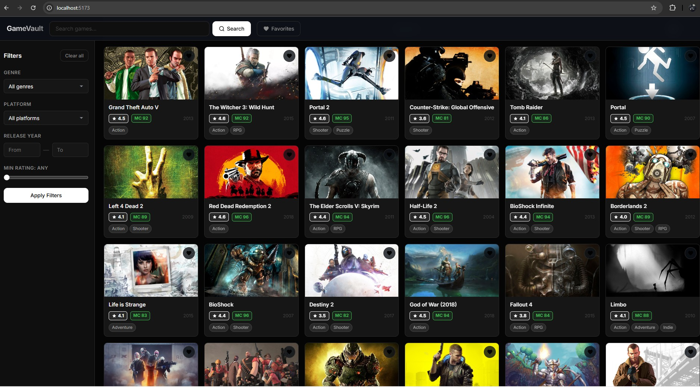
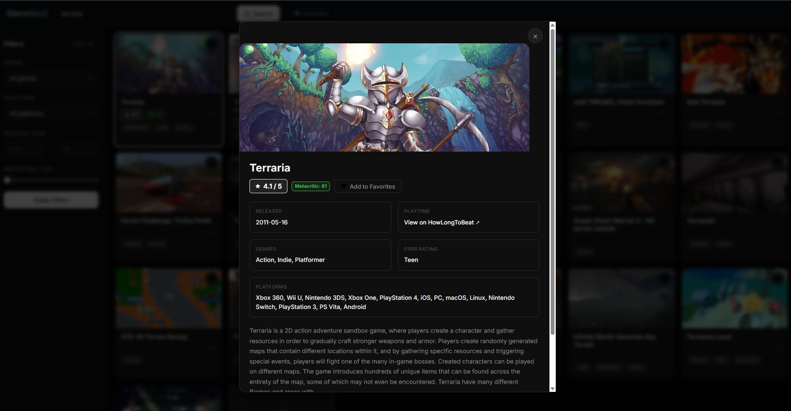

A dark mode game discovery single page application built with vanilla JavaScript 

( and the RAWG video games database API : https://rawg.io/apidocs )


\- \- \-


$\color{green}{\texttt{features :}}$

```
- browse games with cover art / ratings / genres and platforms
- switch between grid view and table view
- search by name with form validation
- filter by genre / platform / release year and minimum rating
- sort by rating / name / metacritic score and release date
- favorites are saved to LocalStorage and persisted between sessions !
- infinite scroll        ( via IntersectionObserver )
- lazy image loading     ( via IntersectionObserver )
- user preferences       ( view mode / sort order ) saved to LocalStorage
- full responsive design ( and is mobile friendly : ) ! )
```

\- \- \-


$\color{green}{\texttt{API used :}}$

```
RAWG Video Games Database  ( https://rawg.io/apidocs )
purpose : Game data — list , detail , genres , platforms
```

\- \- \-


$\color{green}{\texttt{installation !}}$

```
Prerequisites
- Node.js v18 or higher  ( https://nodejs.org/ )
- A free RAWG API key from rawg.io/apidocs

1. clone the repository and open the gamevault folder
2. open a terminal in that folder and run : npm install
3. open src/js/config.js and replace YOUR_RAWG_API_KEY_HERE with your RAWG key
4. start the dev server with : npm run dev
5. open your browser and go to http://localhost:5173

to build for production run : npm run build
```

\- \- \-


$\color{green}{\texttt{Technical Requirements — Implementation Map}}$


$\color{green}{\texttt{1. DOM Manipulation}}$

```
Selecting elements     →  src/js/main.js   const $ = (id) => document.getElementById(id)  ln 41-70
Manipulating elements  →  src/js/main.js   setView() / updateFavBadge() / classList.toggle()  ln 77-90
Attaching events       →  src/js/main.js   all addEventListener calls  ln 195-270
```

$\color{green}{\texttt{2. Modern JavaScript}}$

```
Constants (const)      →  throughout all files — example: const state = { ... } in main.js ln 32
Template literals      →  src/js/ui.js       buildGameCard() / buildTableRow() / renderDetailModal()
Array iteration        →  src/js/ui.js       games.forEach(...) / Array.from({length}).map(...)
Array methods          →  src/js/favorites.js  .find() / .filter() / .some() / .map() / .push()
Arrow functions        →  every file — every function is written as an arrow function
Ternary operator       →  src/js/main.js     setView() function
Callback functions     →  src/js/observers.js  IntersectionObserver callback
Promises               →  src/js/main.js     Promise.all([fetchGenres(), fetchPlatforms()])
Async & Await          →  src/js/api.js      apiFetch() / fetchGames()
Observer API           →  src/js/observers.js  IntersectionObserver — lazy loading + infinite scroll
```

$\color{green}{\texttt{3. Data and API}}$

```
Fetch                  →  src/js/api.js      apiFetch()
JSON manipulation      →  src/js/api.js      response.json() — rendered in ui.js
```

$\color{green}{\texttt{4. Storage and Validation}}$

```
Form validation        →  src/js/main.js     validateSearch()
LocalStorage           →  src/js/favorites.js  ( favorites )
                       →  src/js/storage.js    ( user preferences )
```

$\color{green}{\texttt{5. Styling and Layout}}$

```
Flexbox + CSS Grid     →  src/css/main.css   .games-grid / .app-layout / .toolbar
CSS                    →  src/css/main.css + components.css
User-friendly elements →  remove buttons / heart toggle icons / toast notifications
```

$\color{green}{\texttt{6. Tooling and Structure}}$

```
Vite                   →  vite.config.js / package.json
Folder structure       →  html in root / css + js separated inside src/
```

\- \- \-


$\color{green}{\texttt{Screenshots}}$

```
grid view — browse games with cover art - ratings and genres
```



```
detail modal — game info - metacritic score - playtime link and description

```




\- \- \-


$\color{green}{\texttt{Sources}}$

```
RAWG API Documentation   →  rawg.io/apidocs
HowLongToBeat            →  howlongtobeat.com          ( playtime reference )
MDN Web Docs             →  IntersectionObserver API
MDN Web Docs             →  Fetch API
MDN Web Docs             →  LocalStorage
Vite Documentation       →  vitejs.dev
Inter font               →  fonts.google.com
AI assistance            →  Claude ( Anthropic ) — code generation and structure
AI chatlog               →  Ai chat log claude.pdf  ( see repo )
```
